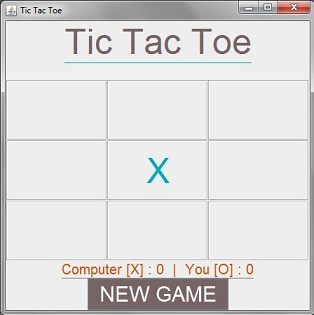
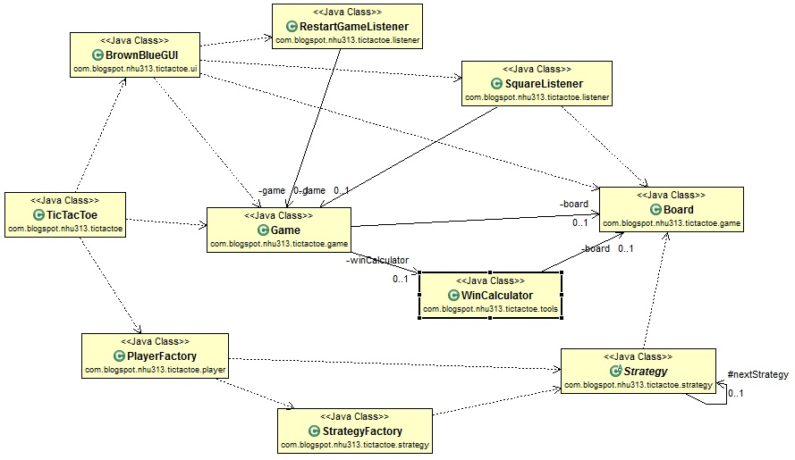

#Overview#
This is a Java Tic Tac Toe game. See [wikipedia](http://en.wikipedia.org/wiki/Tic-tac-toe) for more information on the game. It uses Java swing to create the GUI. To start the game, run com.blogspot.nhu313.tictactoe.<b>TicTacToe</b> as a Java standone application. 

The TicTacToe class decides which UI and which type of player to use. Currently there is only one GUI, com.blogspot.nhu313.tictactoe.ui.BrownBlueGUI. For player, you can use a computer or human. (The AI is supposed to be unbeatable. If you managed to beat it, please let me know how.)
Note: I created the application using Eclipse. The directions below on how to run the application and the tests are mainly for Eclipse or an IDE. In the future, I will try to make it more portable. 

#Running the application#
Run com.blogspot.nhu313.tictactoe.*TicTacToe* as a Java standone application. 
#RunTesting#
The test files live in test. The package of the test files correspond to the package of the files they are testing. The test files uses JUnit and EasyMock to test. The jar needed for testing are in lib/test. 
To run the file, right click on the files you want to run and run it as JUnit test. In Eclipse, if you want to run all of the test files, right click on the "test" folder, then select "Run as" > "Junit Test". 

#Class Design#

Note: I took out TicTacToeValue and Player because it is used by too many class, which makes it harder to understand the diagram. I will only go over the main classes. Hopefully, I name the classes well enough that it is obvious what they do. 
*TicTacToe*
Main class. It decides which GUI to use, which player to run, and which player will go first. Run this class as a standalone application to start the game.
*Player*
Easy player has a name, tic tac toe value (X or O), score, and a strategy. The strategy is what separate a human from a computer (or any other type of player). You can only create a player through PlayerFactory. The factory decides which strategy to create for the player based on which type of player you want. 
Human gets a StrategyNull which the Strategy won't decide which moves to make. 
Player.move() - returns a boolean which indicate whether or not the player moved.
*Strategy*
This class uses the decorator pattern to determine the next move to make. The level of difficulty will be determined by the linkage of the strategies. If you do not wish to use a strategy, call StrategyFactory to get a null strategy. A strategy can and should only be created through StrategyFactory.
*Game*
Holds all the information about the game such as the board, win calcuator, and the players. It has logic to calculate if the last player has won, or if it's a tied game, then switches player if necessary. 
*Board*
Holds information about the board such as the square/box and game messages. It provides methods to mark the board, get moves history, and checks if a given position is a corner. 

#Future State/Things to do#
1. Put the game properties in a properties or xml file, somewhere that can be changed easily. 
2. Make it easier to compile and run
3. Create automated integration tests
4. Separate UI logic so you can easily decide how to draw up the application